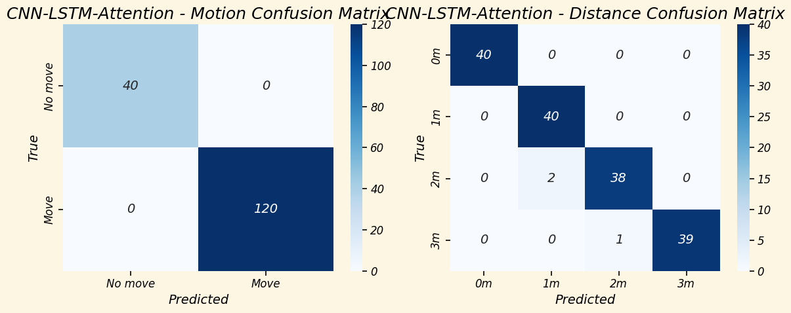
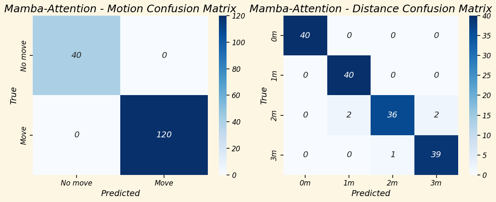
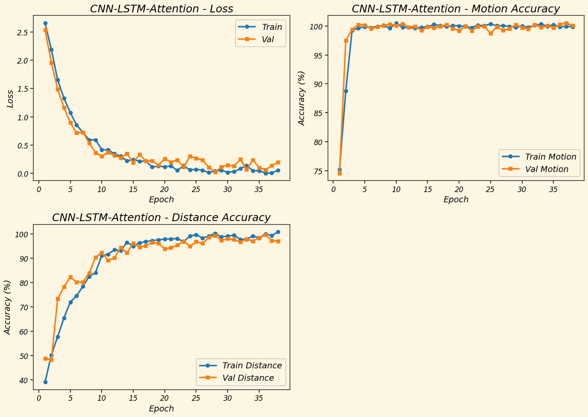
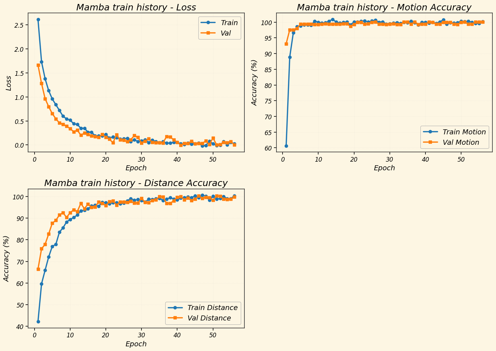

## 1. Цель эксперимента

Кратко: что проверяем, какие гипотезы, какие метрики.

## 2. Данные

- Источник данных:
- Условия сбора:
- Размер выборки:
- Сплиты/валидация:

## 3. Препроцессинг

### 3.1. Описание пайплайна

- Входные артефакты:
- Выходные артефакты:
- Ключевые параметры:

### 3.2. Графики и визуализации

Вставь свои файлы из `notebooks/figures/preprocessing/`:

### 3.3. Контроль качества

- Проверки на пропуски/аномалии:
- Стабильность окна 100×52×3:

## 4. Архитектура системы

### 4.1. Диаграмма end-to-end

### 4.2. Поток данных и артефакты

- `receiver` → `test_*/dev*.data`
- `preprocessor` → тензор для моделей
- `load_model.py` → предсказания

## 5. Модели

### 5.1. CNN+LSTM+Attention

- Схема:

- Параметры обучения:
- Особенности входа:

### 5.2. Mamba-hybrid

- Схема:

- Параметры обучения:
- Особенности входа:

### 5.3. Transformer fusion

- Схема:

- Нормализация (`train_mean.npy`, `train_std.npy`):
- Интерпретация классов:

## 6. Результаты

### 6.1. Метрики

Заполни таблицу:

| Модель | Motion | Distance | Примечание |
| --- | --- | --- | --- |
| CNN+LSTM | 0.963 / 0.99 | 0.891 / 0.99 | полный набор / 3-й человек |
| Mamba | 0.99 / 0.99 | 0.743 / 0.97 | полный набор / 3-й человек |
| Transformer | - |  | distance-only |

### 6.2. Матрицы ошибок и кривые

### 6.3. Анализ ошибок

- Типичные промахи:
- Зависимость от расстояния/сценария:
- Влияние препроцессинга:

## 7. Выводы

Коротко: что сработало, что нет, что делать дальше.

## 8. Воспроизводимость

- Версии:
  - Python:
  - torch:
  - commit hash:
- Веса и статистики: [Google Drive: model weights](https://drive.google.com/drive/folders/1QfCjzMwqpNUO60O4QAo-yu5TQHhVOlhW?usp=sharing)
- Локальные пути (после скачивания): `weights/best_cnn_lstm.pth`, `weights/best_mamba_model.pth`, `weights/best_fusion_csi_model.pth`, `weights/train_mean.npy`, `weights/train_std.npy`
